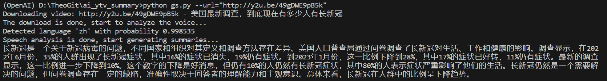

# Youtube Video Summary Generation

Generate a summary for a youtube video with OPEN AI REST API.

The purpose of creating this program is to learn Open AI API, but also to help me watch videos on Youtube more efficiently.

1. First, create a .env file in the current directory.

    ```Env
    # LLM TYPE
    # openai or azure
    AI_API_TYPE=azure

    # OPEN AI config
    OPENAI_API_KEY=[YOUR KEY]

    # Azure OPEN AI config
    AZURE_OPENAI_API_VERSION=2023-06-01-preview
    AZURE_OPENAI_API_BASE=https://[endpoint].openai.azure.com
    AZURE_OPENAI_API_KEY=[YOUR KEY]
    AZURE_OPENAI_DEPLOYMENT_NAME=[DEPLOYMENT_NAME]
    AZURE_OPENAI_MODEL_NAME=text-davinci-003
    ```

1. Execute the following command in your command line tool. e.g.

    ```CLI
    python gs.py --url="http://y2u.be/49gDWE9pB5k"
    ```

1. Once everything works, you should see the screenshot below.

    
